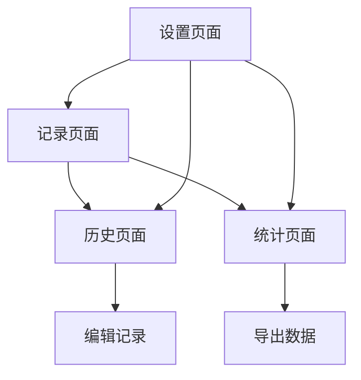

## 1. 产品概述
专为奶爸设计的网页版婴幼儿喂养记录应用，帮助父母轻松记录和管理宝宝的喂养信息。解决新手父母喂养记录混乱、无法掌握喂养规律的问题，提供直观的数据分析帮助科学喂养。

目标用户：0-3岁婴幼儿父母，特别是需要详细记录喂养信息的家庭。

## 2. 核心功能

### 2.1 用户角色
| 角色 | 注册方式 | 核心权限 |
|------|----------|----------|
| 家庭用户 | 邮箱/密码注册登录 | 宝爸宝妈共用同一账号登录，数据云端实时同步，支持多端同时查看和记录喂养数据 |

### 2.2 功能模块
应用包含以下核心页面：
1. **记录页面**：快速记录喂养信息，支持多种喂养类型
2. **历史页面**：按日期查看喂养记录，支持筛选和搜索
3. **统计页面**：展示喂养数据分析图表
4. **设置页面**：数据导出、提醒设置、主题切换

### 2.3 页面详情
| 页面名称 | 模块名称 | 功能描述 |
|----------|----------|----------|
| 记录页面 | 快速记录 | 选择喂养类型（母乳/配方奶/辅食），输入喂养量，添加备注，一键保存 |
| 记录页面 | 喂养类型-母乳 | 支持左右侧互斥计时，支持切换到手动输入时长（分钟），显示距上次喂养的时间间隔 |
| 记录页面 | 喂养类型-配方奶 | 支持输入喂养量（毫升） |
| 记录页面 | 喂养类型-辅食 | 支持输入喂养量（克） |
| 记录页面 | 时间记录 | 自动获取当前时间，支持手动修改喂养时间 |
| 历史页面 | 日期选择 | 日历组件选择查看日期，支持今日/昨日快速切换 |
| 历史页面 | 记录列表 | 按时间倒序展示喂养记录，显示类型、时间、数量、备注 |
| 历史页面 | 编辑删除 | 左滑显示编辑删除按钮，支持修改历史记录 |
| 统计页面 | 今日概览 | 显示今日喂养次数、总喂养量、平均间隔 |
| 统计页面 | 趋势图表 | 近7天喂养量趋势图，支持按类型筛选 |
| 统计页面 | 喂养规律 | 分析喂养时间规律，推荐最佳喂养时间 |
| 设置页面 | 账号管理 | 账号登录/登出，云端数据同步状态显示，导出CSV格式数据 |
| 设置页面 | 提醒设置 | 设置喂养提醒间隔，开启/关闭提醒功能 |
| 设置页面 | 界面设置 | 切换深色/浅色主题，夜间模式优化 |

## 3. 核心流程

### 主要用户流程
1. **快速记录流程**：打开应用 → 选择喂养类型 → 输入喂养量 → 添加备注（可选）→ 保存记录
2. **查看历史流程**：进入历史页面 → 选择日期 → 查看当日喂养记录 → 编辑或删除记录
3. **数据分析流程**：进入统计页面 → 查看今日概览 → 切换时间范围 → 分析喂养趋势

## 4. 用户界面设计

### 4.1 设计风格
- **主色调**：温暖橙色(#FF6B35)配舒适蓝色(#4ECDC4)
- **按钮样式**：大圆角设计，易于点击，夜间模式支持
- **字体选择**：系统默认字体，确保跨平台兼容性
- **布局风格**：卡片式布局，信息层次清晰
- **图标风格**：圆润线条图标，亲和力强

### 4.2 页面设计概览
| 页面名称 | 模块名称 | UI元素 |
|----------|----------|--------|
| 记录页面 | 快速记录 | 顶部大卡片显示当前时间，圆形按钮选择喂养类型，滑块输入喂养量，底部保存按钮 |
| 记录页面 | 母乳计时 | 顶部显示标题和距离上次喂养的时间间隔，提供“计时/手动输入”分段控制器，主区域展示左右侧互斥的计时器或时长输入框，底部固定保存按钮 |
| 历史页面 | 记录列表 | 时间轴设计，左侧显示时间，右侧卡片显示详细信息，支持左右滑动操作 |
| 统计页面 | 数据图表 | 顶部数字卡片展示关键指标，折线图展示趋势，底部饼图显示类型分布 |
| 设置页面 | 功能列表 | 简洁列表布局，图标+文字说明，开关组件控制功能状态 |

### 4.3 响应式设计
- **桌面优先**：基础设计针对桌面端优化
- **移动端适配**：完全响应式布局，支持各种屏幕尺寸
- **触摸优化**：按钮大小适合手指点击，支持手势操作
- **横竖屏适配**：自动适配设备方向变化

### 4.4 夜间模式
- **深色主题**：深灰背景配浅色文字，减少夜间刺激
- **护眼模式**：降低蓝光，使用暖色调
- **自动切换**：根据时间自动切换日夜模式
- **手动控制**：用户可手动选择主题模式