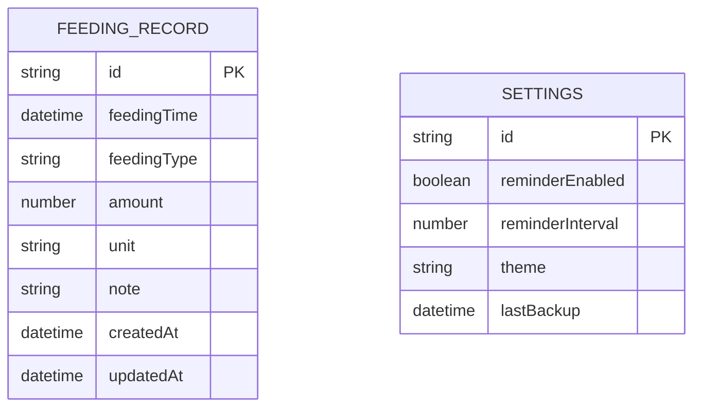

## 1. 架构设计

```mermaid
graph TD
  A[用户浏览器/手机端] --> B[Vue 3 前端应用 (Vercel 托管)]
  B --> C[Supabase Auth (鉴权)]
  B --> D[Supabase PostgreSQL (云端数据库)]
  
  subgraph "前端层"
    B
  end
  
  subgraph "BaaS 云服务层"
    C
    D
  end
```

## 2. 技术栈描述

- **前端框架**: Vue 3 + TypeScript + Vite
- **状态管理**: Pinia
- **路由管理**: Vue Router
- **UI组件库**: 自研组件（基于用户需求，结合 Tailwind CSS）
- **图表库**: Chart.js 或 ECharts
- **日期处理**: dayjs
- **后端服务**: Supabase (提供 PostgreSQL 数据库、REST API 和用户鉴权)
- **部署平台**: Vercel (前端自动化构建与全球边缘节点托管)

## 3. 路由定义

| 路由 | 用途 |
|------|------|
| / | 首页（记录页面），快速记录喂养信息 |
| /history | 历史页面，查看喂养记录历史 |
| /statistics | 统计页面，展示数据分析图表 |
| /settings | 设置页面，应用配置和数据管理 |

## 4. 数据模型

### 4.1 数据模型定义



### 4.2 数据定义语言

喂养记录表 (feeding_records)
```typescript
interface FeedingRecord {
  id: string
  feedingTime: Date // 喂养开始时间
  feedingType: 'breast_milk_left' | 'breast_milk_right' | 'formula' | 'complementary_food'
  amount?: number // 配方奶/辅食：毫升或克
  duration?: number // 母乳：时长（分钟）
  unit?: 'ml' | 'g' | 'min'
  note?: string
  createdAt: Date
  updatedAt: Date
}
```

设置表 (settings)
```typescript
interface Settings {
  id: string
  reminderEnabled: boolean
  reminderInterval: number // 小时
  theme: 'light' | 'dark' | 'auto'
  lastBackup?: Date
}
```

### 4.3 数据库实现 (Supabase)

使用 Supabase 提供的 PostgreSQL 数据库，并开启 Row Level Security (RLS) 确保数据隔离：

```sql
-- 创建喂养记录表
CREATE TABLE feeding_records (
  id UUID DEFAULT uuid_generate_v4() PRIMARY KEY,
  user_id UUID REFERENCES auth.users(id) NOT NULL, -- 关联共用账号
  feeding_time TIMESTAMPTZ NOT NULL,
  feeding_type TEXT NOT NULL,
  amount NUMERIC,
  duration NUMERIC,
  unit TEXT,
  note TEXT,
  created_at TIMESTAMPTZ DEFAULT NOW(),
  updated_at TIMESTAMPTZ DEFAULT NOW()
);

-- 开启 RLS
ALTER TABLE feeding_records ENABLE ROW LEVEL SECURITY;

-- 允许用户读写自己的数据
CREATE POLICY "Users can manage their own feeding records" 
ON feeding_records FOR ALL 
USING (auth.uid() = user_id);
```

前端通过 `@supabase/supabase-js` 客户端与数据库交互：
```typescript
import { createClient } from '@supabase/supabase-js'

const supabaseUrl = import.meta.env.VITE_SUPABASE_URL
const supabaseAnonKey = import.meta.env.VITE_SUPABASE_ANON_KEY

export const supabase = createClient(supabaseUrl, supabaseAnonKey)
```

## 5. 组件架构

### 5.1 核心组件结构

```
src/
├── components/
│   ├── recording/
│   │   ├── FeedingTypeSelector.vue
│   │   ├── BreastMilkTimer.vue // 母乳计时器（包含左右侧互斥和手动输入）
│   │   ├── AmountInput.vue
│   │   ├── QuickRecord.vue
│   │   └── NoteInput.vue
│   ├── history/
│   │   ├── DateSelector.vue
│   │   ├── RecordList.vue
│   │   └── RecordItem.vue
│   ├── statistics/
│   │   ├── TodayOverview.vue
│   │   ├── TrendChart.vue
│   │   └── FeedingPattern.vue
│   └── common/
│       ├── ThemeToggle.vue
│       ├── DataExport.vue
│       └── ReminderSettings.vue
├── stores/
│   ├── feeding.ts (Pinia store)
│   └── settings.ts (Pinia store)
├── types/
│   ├── feeding.ts (TypeScript 类型定义)
│   └── settings.ts
└── utils/
    ├── storage.ts (IndexedDB 工具)
    ├── date.ts (日期处理工具)
    └── export.ts (数据导出工具)
```

### 5.2 状态管理设计

使用 Pinia 进行状态管理：

```typescript
// stores/feeding.ts
export const useFeedingStore = defineStore('feeding', {
  state: () => ({
    records: [] as FeedingRecord[],
    currentRecord: null as FeedingRecord | null,
    isLoading: false
  }),
  
  actions: {
    async addRecord(record: Omit<FeedingRecord, 'id' | 'createdAt' | 'updatedAt'>) {
      // 添加记录逻辑
    },
    
    async getRecordsByDate(date: Date) {
      // 按日期获取记录
    },
    
    async deleteRecord(id: string) {
      // 删除记录
    }
  },
  
  getters: {
    todayStats: (state) => {
      // 计算今日统计数据
    },
    
    feedingPattern: (state) => {
      // 分析喂养规律
    }
  }
})
```

## 6. 性能优化

### 6.1 数据查询优化
- 使用 IndexedDB 索引优化查询性能
- 实现数据分页加载，避免一次性加载大量数据
- 使用虚拟滚动优化长列表性能

### 6.2 缓存策略
- 内存缓存常用数据（如今日记录）
- 使用 computed 属性缓存计算结果
- 实现数据变更监听，自动更新相关组件

### 6.3 兼容性处理
- 使用 Polyfill 确保 IndexedDB 兼容性
- CSS 前缀处理确保跨浏览器兼容性
- 降级方案：IndexedDB 不可用时使用 localStorage